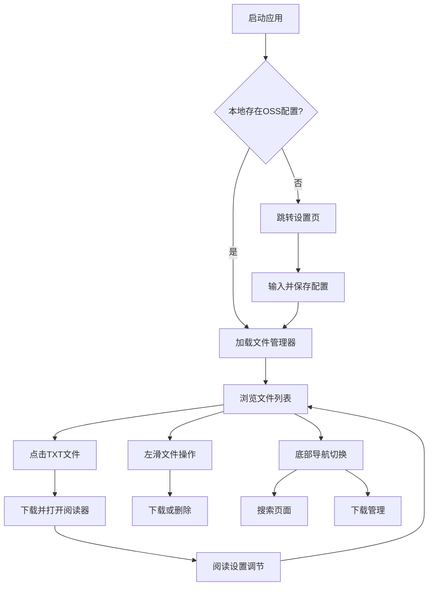

## 1. Product Overview
Client-Side OSS File Manager 是一个纯前端、隐私优先的移动端单页应用，专为手机浏览器优化，用于安全地管理阿里云OSS上的文本文件。所有配置和密钥仅保存在用户浏览器本地，无需后端服务器，解决传统SQLite版本无法公网部署的问题。

目标用户：需要在手机上安全、私密地浏览和管理OSS文本文件的个人用户。核心价值：零服务器成本、绝对隐私保护、移动优先体验、即开即用。

## 2. Core Features

### 2.1 User Roles
| Role | Registration Method | Core Permissions |
|------|---------------------|------------------|
| 普通用户 | 无需注册，本地配置OSS密钥 | 完整文件管理权限 |

### 2.2 Feature Module
本应用包含以下核心页面：
1. **文件管理器页**：移动端优化的文件列表、底部导航栏、顶部搜索栏。
2. **TXT阅读器页**：专为手机优化的文本阅读界面、字体调节、主题切换、编码识别。
3. **设置页**：OSS配置表单、本地存储管理、主题切换、下载管理。

### 2.3 Page Details
| Page Name | Module Name | Feature description |
|-----------|-------------|---------------------|
| 文件管理器页 | 文件列表 | 移动端卡片式布局，显示文件名称和大小，支持下拉刷新、上拉加载更多、长按多选。 |
| 文件管理器页 | 底部导航栏 | 提供首页、搜索、设置三个主要入口，图标大而清晰，适合拇指操作。 |
| 文件管理器页 | 顶部搜索栏 | 可折叠的搜索功能，支持按文件名搜索，搜索结果实时显示。 |
| 文件管理器页 | 文件操作 | 左滑显示操作按钮（下载、删除），点击进入文件夹，点击TXT文件进入阅读器。 |
| TXT阅读器页 | 阅读界面 | 全屏阅读模式，自动识别编码，支持字体大小调节、主题切换、翻页模式。 |
| TXT阅读器页 | 阅读控制 | 顶部显示文件名和进度，底部提供字体设置、主题切换、返回按钮。 |
| 设置页 | OSS配置 | 简化配置界面，仅显示必要字段，支持扫码输入（调用相机）。 |
| 设置页 | 下载管理 | 显示已下载的TXT文件列表，支持离线阅读、删除本地缓存。 |
| 设置页 | 主题设置 | 提供亮色/暗色/护眼（Sepia）三种主题，跟随系统或手动切换。 |

## 3. Core Process
首次使用流程：用户进入应用 → 自动跳转设置页 → 输入OSS凭证 → 测试连接成功 → 自动跳转文件管理器 → 加载根目录 → 开始使用。

日常操作：文件管理器内点击目录进入子目录 → 点击文件打开编辑器 → 编辑后保存 → 返回文件管理器 → 继续其他操作。

删除流程：选中文件 → 点击删除 → 移动到trash/前缀目录 → 可在回收站查看 → 选择彻底删除或还原。

## 4. User Interface Design

### 4.1 Design Style
- **主色**：#1677FF（阿里云蓝），辅色：#52C41A（成功绿）、#FF4D4F（错误红）。
- **按钮**：大圆角8px，最小触控区域48x48px，主按钮填充主色，次要按钮边框主色。
- **字体**：系统默认字体，16px正文，18px标题，14px辅助文字，支持字体大小调节。
- **布局**：底部导航栏高度64px，顶部导航栏高度56px，内容区域自适应，支持单手操作。
- **图标**：使用lucide-react线性图标，统一2px线宽，图标尺寸24x24px，颜色与文字一致。
- **交互**：长按多选、左滑操作、下拉刷新、上拉加载更多，所有操作都适合拇指操作。

### 4.2 Page Design Overview
| Page Name | Module Name | UI Elements |
|-----------|-------------|-------------|
| 文件管理器页 | 文件列表 | 卡片式布局，每行高度72px，文件图标24px，文件名16px，文件大小12px，长按显示多选模式。 |
| 文件管理器页 | 底部导航栏 | 白色背景，顶部阴影，三个图标平均分布，选中状态显示主色，未选中显示灰色。 |
| 文件管理器页 | 顶部搜索栏 | 可折叠设计，搜索时全屏显示，支持实时搜索，搜索结果高亮匹配文字。 |
| TXT阅读器页 | 阅读界面 | 全屏无干扰模式，背景色根据主题变化（白色/黑色/护眼黄色），字体大小可调节（14px-24px）。 |
| TXT阅读器页 | 阅读控制栏 | 底部悬浮工具栏，半透明背景，提供字体大小、主题切换、进度显示，自动隐藏。 |
| 设置页 | OSS配置 | 垂直表单布局，输入框高度48px，大字体标签，支持相机扫码输入，测试连接按钮置底。 |
| 设置页 | 下载管理 | 显示已下载文件列表，支持左滑删除，显示文件大小和下载时间，支持离线阅读状态标识。 |

### 4.3 Responsiveness
移动优先设计，专为手机浏览器优化。布局采用底部导航栏、大触控目标、滑动操作。适配各种屏幕尺寸，确保在iOS Safari和Android Chrome上都有良好体验。

### 4.4 3D Scene Guidance
不适用，本应用为2D管理界面。