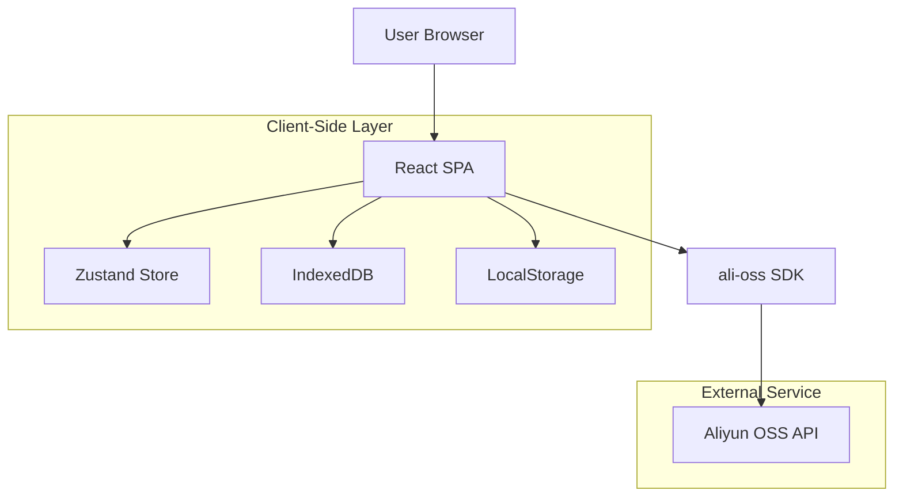
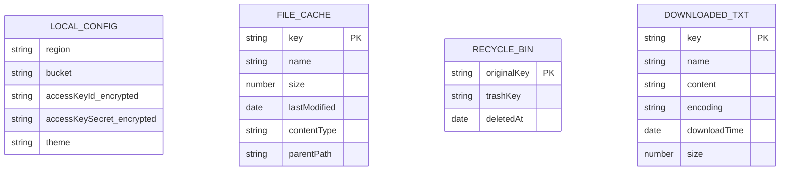

## 1. Architecture design



## 2. Technology Description

* **Frontend**: React\@18 + TypeScript\@5 + Vite\@5

* **UI Framework**: tailwindcss\@3 + shadcn/ui\@latest（移动端优化配置）

* **Mobile Components**: react-swipeable-list（滑动操作）、react-window（虚拟滚动）

* **State Management**: zustand\@4

* **OSS SDK**: ali-oss\@6

* **TXT Reader**: 自定义阅读器组件（支持字体调节、主题切换）

* **Router**: react-router-dom\@6

* **Storage**: localforage\@1 (IndexedDB封装)

* **Encoding Detection**: chardet\@2（编码自动识别）

* **Encryption**: crypto-js\@4

* **Initialization Tool**: vite-init

* **Backend**: None（纯客户端架构）

## 3. Route definitions

| Route      | Purpose          |
| ---------- | ---------------- |
| /          | 文件管理器主页，移动端优化布局  |
| /settings  | OSS配置与本地存储管理     |
| /reader/\* | TXT阅读器，\*为文件路径参数 |
| /downloads | 已下载文件管理页面        |

## 4. API definitions

本应用直接调用阿里云OSS API，无自定义后端API。核心SDK方法封装如下：

### 4.1 OSS Client初始化

```typescript
interface OSSConfig {
  region: string
  bucket: string
  accessKeyId: string
  accessKeySecret: string
  secure: true
}

const initOSSClient = (config: OSSConfig): OSS => {
  return new OSS(config)
}
```

### 4.2 文件列表获取

```typescript
interface ListObjectsParams {
  prefix?: string
  marker?: string
  maxKeys?: number
}

interface OSSObject {
  name: string
  size: number
  lastModified: Date
  type: 'file' | 'directory'
}
```

### 4.3 TXT文件处理

```typescript
interface TXTReaderConfig {
  fontSize: number // 字体大小，默认16px
  theme: 'light' | 'dark' | 'sepia' // 阅读主题
  encoding: string // 文件编码，如'UTF-8'、'GBK'
  pagination: boolean // 是否分页模式
}

interface DownloadedFile {
  key: string
  name: string
  content: string
  encoding: string
  downloadTime: Date
  size: number
}
```

## 5. Server architecture diagram

不适用，本应用为纯客户端架构，无服务器端组件。

## 6. Data model

### 6.1 客户端存储模型



### 6.2 本地存储结构

**IndexedDB - file\_cache表**

```javascript
// 使用localforage封装
const fileCache = localforage.createInstance({
  name: 'oss_file_manager',
  storeName: 'file_cache'
})

// 单条记录结构
{
  key: 'articles/2024/readme.md',
  name: 'readme.md',
  size: 1024,
  lastModified: '2024-02-04T12:00:00Z',
  contentType: 'text/markdown',
  parentPath: 'articles/2024'
}
```

**LocalStorage - 配置存储**

```javascript
// 密钥加密存储
const encryptedConfig = {
  region: 'oss-cn-hangzhou',
  bucket: 'my-bucket',
  accessKeyId: AES.encrypt('真实ID', '用户自定义密码').toString(),
  accessKeySecret: AES.encrypt('真实密钥', '用户自定义密码').toString()
}
```

**IndexedDB - 已下载TXT文件**

```javascript
const downloadedTXT = localforage.createInstance({
  name: 'oss_file_manager',
  storeName: 'downloaded_txt'
})

// 记录结构
{
  key: 'articles/novel.txt',
  name: 'novel.txt',
  content: '文件内容...',
  encoding: 'UTF-8',
  downloadTime: '2024-02-04T12:00:00Z',
  size: 1024000
}
```

**移动端优化配置**

```javascript
// shadcn/ui 移动端配置
const mobileConfig = {
  // 使用Drawer替代Dialog
  sheet: {
    side: 'bottom', // 底部弹出
  },
  // 增大触控目标
  button: {
    size: 'lg', // 大按钮
  },
  // 简化表单
  form: {
    layout: 'vertical', // 垂直布局更适合手机
  }
}
```

